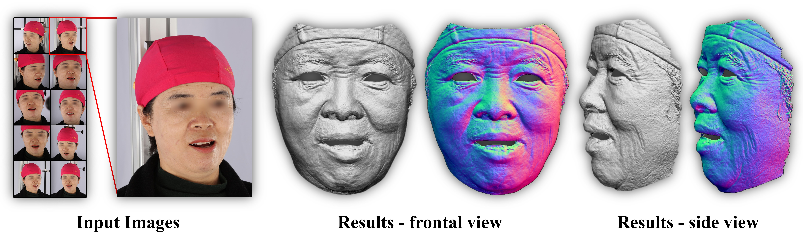
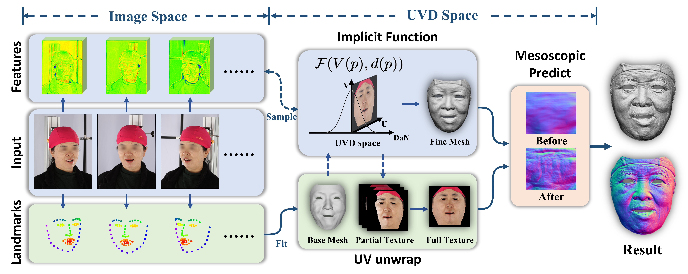

# Detailed Facial Geometry Recovery from Multi-View Images by Learning an Implicit Function

## About
In this paper, we propose a novel architecture to recover extremely detailed 3D faces in roughly 10 seconds. Unlike previous learning-based methods that regularize the cost volume via 3D CNN, we propose to learn an implicit function for regressing the matching cost. By fitting a 3D morphable model from multi-view images, the features of multiple images are extracted and aggregated in the mesh-attached UV space, which makes the implicit function more effective in recovering detailed facial shape.



### Our Pipeline

Our pipeline consists of three parts: base mesh ftting (green blocks), implicit function learning (blue blocks), and mesoscopic recovery (pink block).

### Citation
```
@InProceedings{xiao2022detailed,
author = {Xiao, Yunze and Zhu, Hao and Yang, Haotian and Diao, Zhengyu and Lu, Xiangju and Cao, Xun},
title = {Detailed Facial Geometry Recovery from Multi-View Images by Learning an Implicit Function},
booktitle = {Proceedings of the AAAI Conference on Artificial Intelligence},
year = {2022}
}
```
## How to use

### Installation

We recommend to use `Python 3.6` for the following instruction
* `pip install -r requirements.txt`

Install `psbody-mesh` from [here](https://github.com/MPI-IS/mesh).

### Download

#### Models

Before running the scripts, please download the predefined data from [here](https://box.nju.edu.cn/f/276275d42c7d48e3bc43/?dl=1). And unpack them to folder `./predfine_data/`  
Please download the meso model from [here](https://box.nju.edu.cn/f/11c90860dfc3418393db/?dl=1). And put it into folder `./dpmap_pred/checkpoints/
`

#### Dataset

* For demo, you can download a small set of data from [here](https://box.nju.edu.cn/f/624002278ff74b92a730/?dl=1)
* For the FaceScape Dataset used in our paper, there are two alternative ways to obtain. 
  1.  You can download the original images and 3D models(raw scan) from [FaceScape Dataset](https://facescape.nju.edu.cn/). And unpack the data to the `FACESCAPE_DATA_FOLDER`
  Some metadata from [link]() to `DATA_FOLDER`.
  2.  You can download our processed images which only contains 10 views with lower resolution. These images are generated by running `python preprocess_images.py`. You should also get the ground truth 3D models from [FaceScape Dataset](https://facescape.nju.edu.cn/) too. Considering all the 3D models are too large, you can use our base mesh and related maps which are generated by running `python gen_maps.py`. The base mesh and related maps that we offer may have some differences from those generated by the script. It is because the code version and has low influence on the final results.
  Download our processed data by [link](https://facescape.nju.edu.cn/)
  And unpack the data to the `DATA_FOLDER`.
  
Then we recommend to run the following scripts.
* Building the structure of the data folder `python mkdirs.py` (You need set `dataroot=DATA_FOLDER` in `mkdirs.py`)
* Processing images from FaceScape Dataset `python preprocess_images.py` (You can skip it if you use our data). Before running, you should set the `dataroot` related args(`facescape_dataroot` as `FACESCAPE_DATA_FOLDER`  

##### Dataset metadata information
* `select_dict.json` -- index of used images.  
```
{ 
  person_id: {
    expression_id: index_list
  }
}
```
* `id.json` -- index of trainset and evalset
* `Rt_scale_dict.json` -- scale from model to millimeter(mm)
```
{
  person_id: {
    expression_id: [scale, Rt]
  }
}
```
* `facial_mask.png` -- mask in uv


### Evaling 

Our method consists of several parts in the following order.
* Run `python gen_maps.py` for base mesh fitting
* Run `python eval_if.py` for implicit function learning  
  lower `num_sample` in `eval_if.py` for lower GPU memory occupation
* Run `python eval_reg.py` for post regularization  
* Run `python gen_tex.py` for blended texture
* Run `cd dpmap_pred && python dpmap_pred/main.py --input DATAFOLDER/pred/texture_relocated --output DATAFOLDER/pred/pred/dp_map` for mesoscopic prediction  
 
If you want to use dpmap to get mesh of mesoscopic prediction, set the folder in `dpmap_pred/scripts/dpmap2mesh.py` and run `python dpmap_pred/scripts/dpmap2mesh.py`. It may cost some time for generating.

You can modifiy the config file `options.py` or use args `--ARGS` in command like `python eval_if.py --d_size 201`  
Before running, you should set the `dataroot` related args(`fit_dataroot`, `if_dataroot`, `reg_dataroot`) as `DATA_FOLDER`  

### Traning

Our method consists of several parts in the following order.
* Run `python gen_maps.py` and edit `mod="train"` in `gen_maps.py` for generating base mesh
* Run `python train_if.py` for training implicit function learning module
* Run `python eval_if.py` and edit `mod="train"` in `eval_if.py` for generating trainset of post regularization 
* Run `python train_reg.py` for training post regularization


